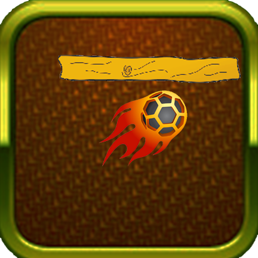
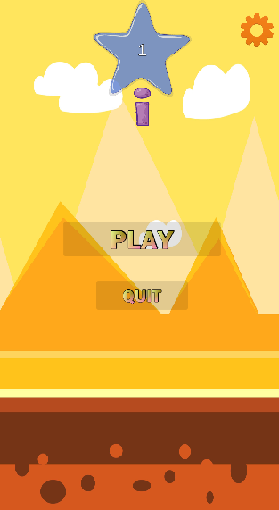
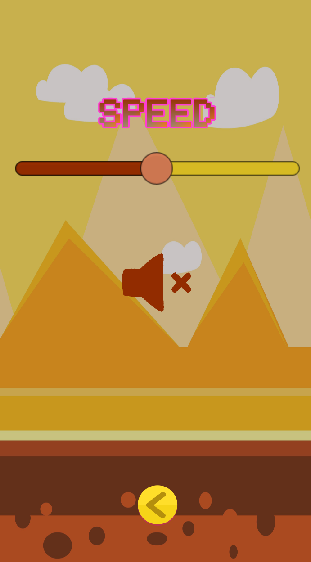
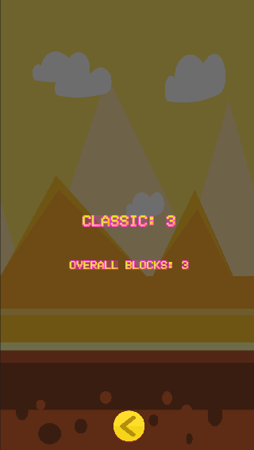
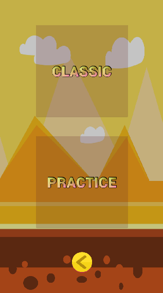
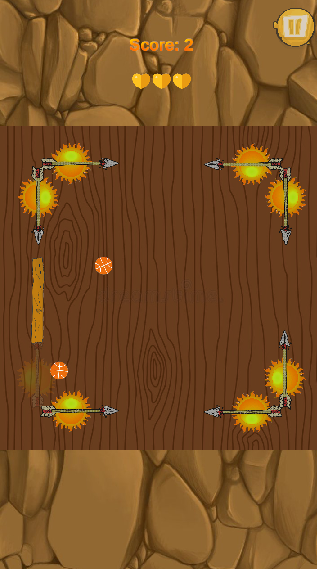
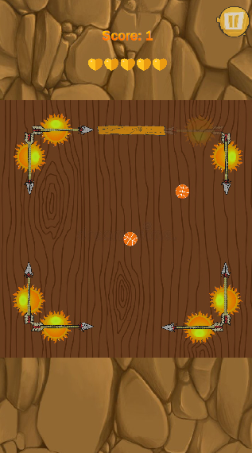
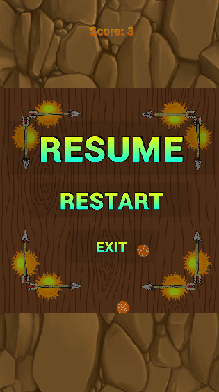
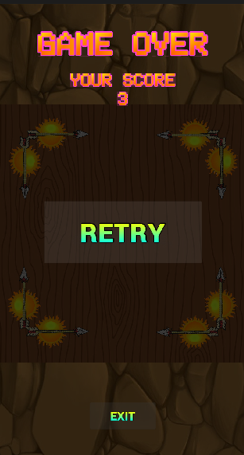

# Block The Balls

  

# Introduction
Block the ball is a simple Android game that calls upon the player to block balls using sticks. It requires patience and most importantly timing. There are 8 areas where user can tap and create sticks. Each area has a fixed direction in which the created stick will move. So, to block the moving balls, player will have to tap the right area at the right time. If the player creates the sticks too soon the stick will be ahead of the ball, if the player creates the stick too late the ball will be gone before the stick reaches the ball’s position. To block a ball the player will have to perfectly match the timing with the ball. The ball will be created at the center and will start to move in a random direction. User will have to touch the ball using sticks before the ball disappear from the screen.

**Game Link**: [https://drive.google.com/file/d/1GacdkJJSzlU4F1hY9yC3dMoVZttWCZdE/view?usp=sharing](https://drive.google.com/file/d/1GacdkJJSzlU4F1hY9yC3dMoVZttWCZdE/view?usp=sharing)

# Screenshots

